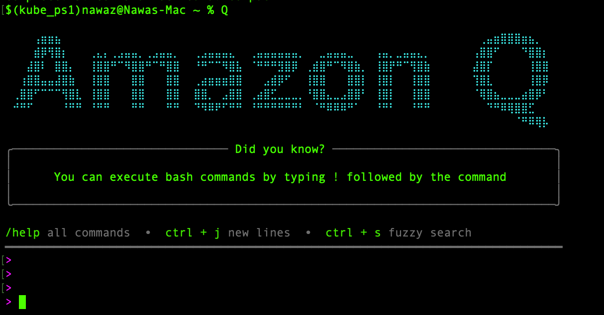
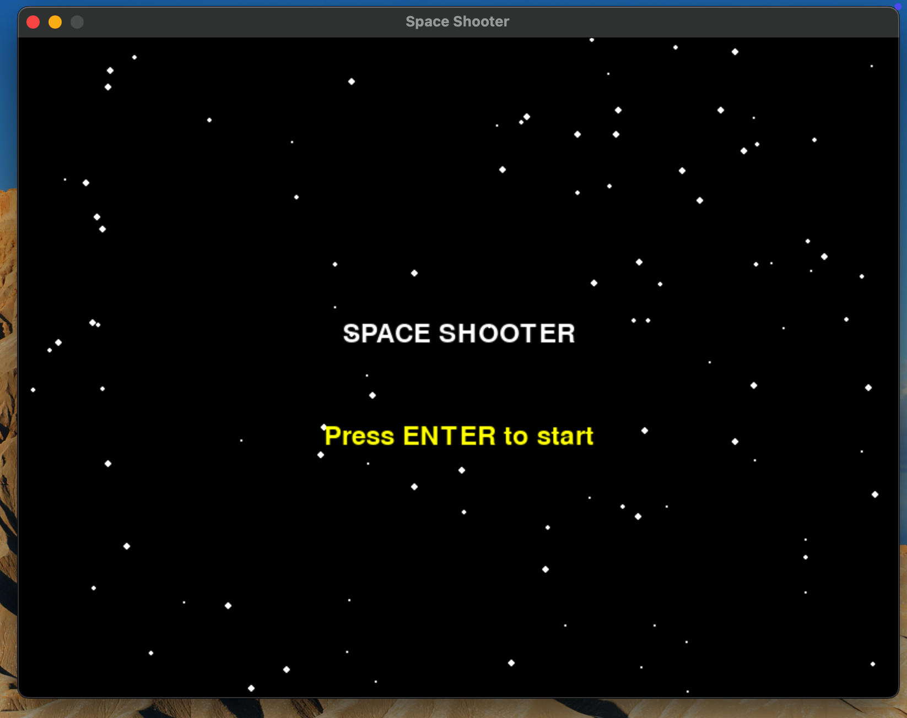
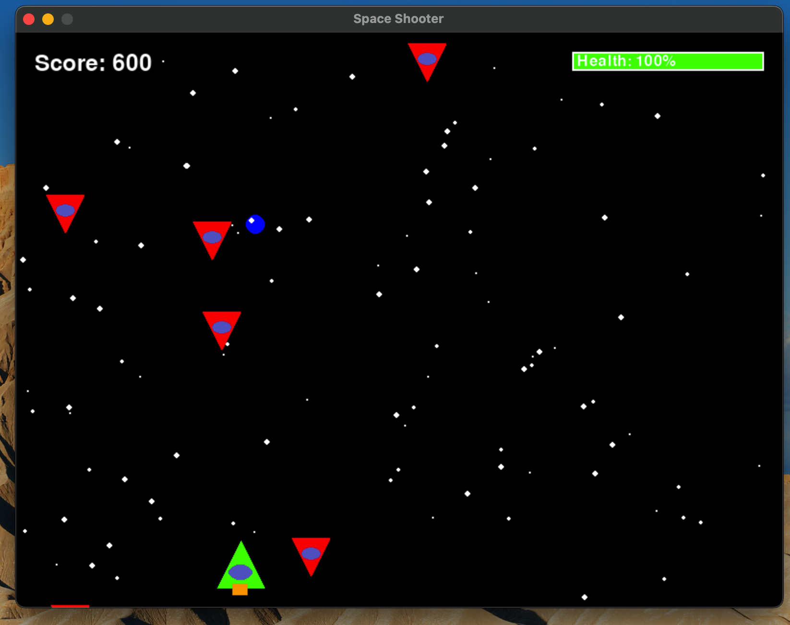
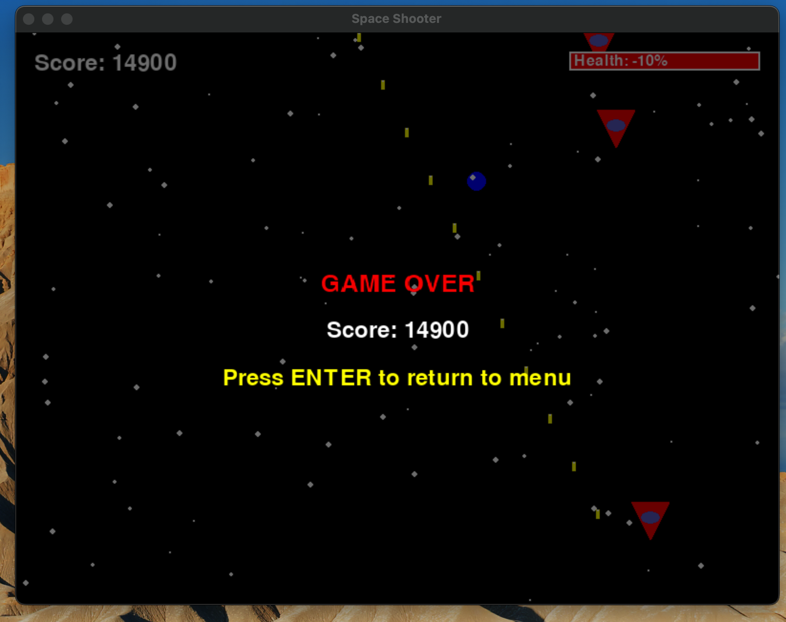

# 🚀 Space Shooter Game with Python & Pygame (Built with Amazon Q CLI)

A classic 2D arcade-style space shooter game built using **Python** and **Pygame**, with the assistance of **Amazon Q CLI**. This project demonstrates essential game development concepts such as collision detection, sprite animation, power-ups, and game state management—making it a great starting point for developers looking to enter the world of game programming.

---

## 🤖 Built with Amazon Q CLI

This project was developed using the [**Amazon Q Developer CLI**](https://docs.aws.amazon.com/amazonq/latest/dev/what-is-amazon-q-cli.html), a powerful AI-powered coding assistant that helps developers:

- Generate and scaffold code quickly
- Refactor and debug existing logic
- Ask technical questions directly in the terminal
- Auto-generate tests and documentation

Amazon Q CLI significantly accelerated the prototyping and iteration process, enabling a faster build of the game's architecture and features.

> ✅ **Why Amazon Q?**  
> Using Amazon Q CLI allowed me to rapidly prototype game components, troubleshoot issues in real-time, and stay focused on gameplay logic while the AI handled boilerplate and structure suggestions.

---

## 🖥️ Demo

Demo: 

https://github.com/user-attachments/assets/d341b695-c862-47ea-a9bc-311f220f6409

---

## 🧩 Features

- 🎮 Player-controlled spaceship with smooth movement
- 👾 Enemy ships with progressive difficulty
- 💥 Shooting mechanics with bullet collision detection
- ❤️ Health bar and score tracking
- ⚡ Power-ups with time-based effects and glowing aura
- 🌌 Dynamic starfield background
- 🕹️ Game state management (menu, gameplay, pause, game over)
- ✨ Procedurally generated graphics—no image assets required!

---

## 🛠 Technology Stack

| Technology | Purpose |
|------------|---------|
| **Python 3.7+** | Game logic and core implementation |
| **Pygame** | Rendering, event handling, and audio |
| **Amazon Q CLI** | AI-powered code generation and development acceleration |

---

## 📁 Project Structure

